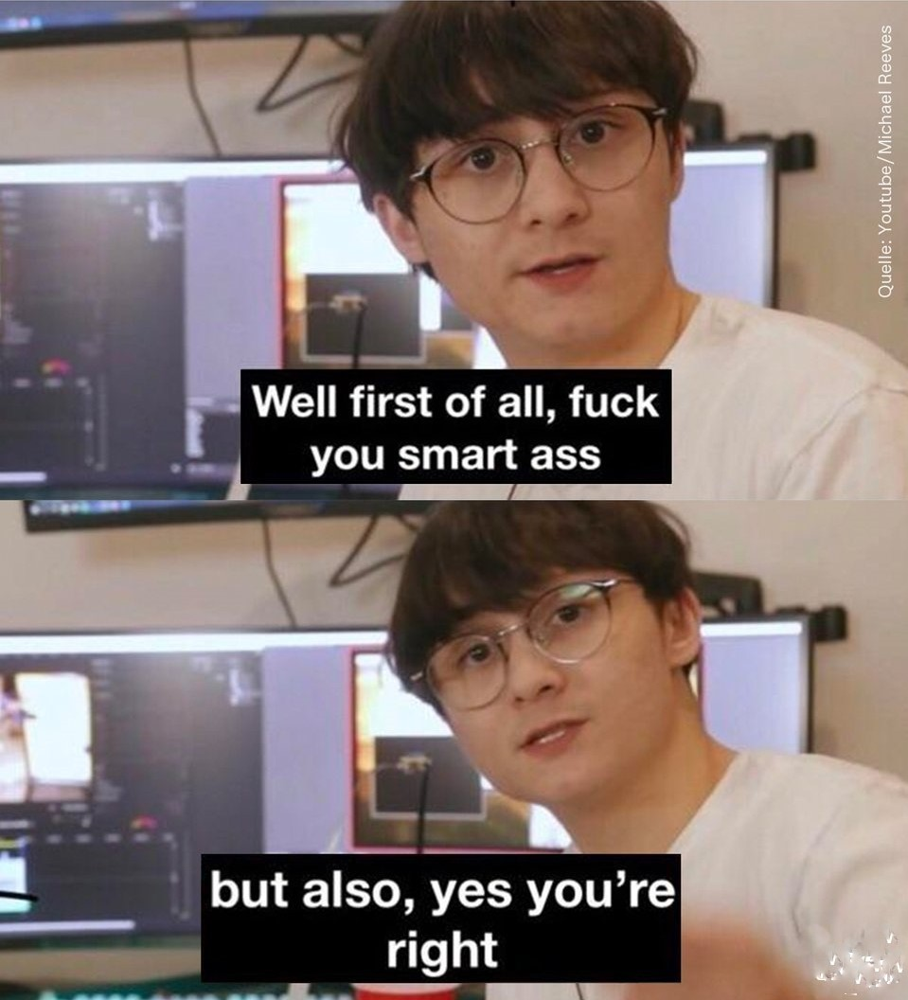

# GitHub README Connect4

Here you can play Connect4. It's your turn to play! Just click under the grid, where to put the next a <!-- BEGIN TURN -->yellow<!-- END TURN --> piece.

<!-- BEGIN CONNECT4 BOARD -->
|   | 1 | 2 | 3 | 4 | 5 | 6 | 7 |   |
|---|:-:|:-:|:-:|:-:|:-:|:-:|:-:|:-:|
|---| |  |  |  |  |  |  | |---|
|---| |  |  |  |  |  |  | |---|
|---| |  |  |  |  |  |  | |---|
|---| |  |  |  |  |  |  | |---|
|---| |  |  |  |  |  |  | |---|
|---| |  |  |  |  |  |  | |---|
|   | [1](https://github.com/bloedboemmel/readme-connect4/issues/new?body=Please+do+not+change+the+title.+Just+click+%22Submit+new+issue%22.+You+don%27t+need+to+do+anything+else+%3AD&title=Connect4%3A+Put+1) | [2](https://github.com/bloedboemmel/readme-connect4/issues/new?body=Please+do+not+change+the+title.+Just+click+%22Submit+new+issue%22.+You+don%27t+need+to+do+anything+else+%3AD&title=Connect4%3A+Put+2) | [3](https://github.com/bloedboemmel/readme-connect4/issues/new?body=Please+do+not+change+the+title.+Just+click+%22Submit+new+issue%22.+You+don%27t+need+to+do+anything+else+%3AD&title=Connect4%3A+Put+3) | [4](https://github.com/bloedboemmel/readme-connect4/issues/new?body=Please+do+not+change+the+title.+Just+click+%22Submit+new+issue%22.+You+don%27t+need+to+do+anything+else+%3AD&title=Connect4%3A+Put+4) | [5](https://github.com/bloedboemmel/readme-connect4/issues/new?body=Please+do+not+change+the+title.+Just+click+%22Submit+new+issue%22.+You+don%27t+need+to+do+anything+else+%3AD&title=Connect4%3A+Put+5) | [6](https://github.com/bloedboemmel/readme-connect4/issues/new?body=Please+do+not+change+the+title.+Just+click+%22Submit+new+issue%22.+You+don%27t+need+to+do+anything+else+%3AD&title=Connect4%3A+Put+6) | [7](https://github.com/bloedboemmel/readme-connect4/issues/new?body=Please+do+not+change+the+title.+Just+click+%22Submit+new+issue%22.+You+don%27t+need+to+do+anything+else+%3AD&title=Connect4%3A+Put+7) |   |
<!-- END CONNECT4 BOARD -->
<!-- BEGIN MOVES LIST -->
<!-- END MOVES LIST -->
Having fun? Ask a friend to do the next move!

#### How it works

When you click on a link and submit a new issue with the desired move, a GitHub action is triggered, which in turn runs a small python script that performs the specified movement, updates this README file and commits the changes.

Maybe you already figured out, that this game is very much like [the README-Chessgame from marcizhu ](https://github.com/marcizhu/readme-chess). I indeed copied a lot from his code, but wrote my own Connect4-Script. I hope to get more independent of that, but till then I need to rely on his code snippets!

Have you spotted a bug? Something missing? Feel free to open an [issue](https://github.com/bloedboemmel/readme-connect4/issues) and I will try to fix it as soon as possible :D

  
Last 5 moves in this game

<!-- BEGIN LAST MOVES -->

| Move | Author |
| :--: | :----- |
| `7` |  [ @Carol42](https://github.com/Carol42) | |
| `4` |  [ @antjacquemin](https://github.com/antjacquemin) | |
| `7` |  [ @bloedboemmel](https://github.com/bloedboemmel) | |
| `5` |  [ @bloedboemmel](https://github.com/bloedboemmel) | |
| `Start game` |  [ @bloedboemmel](https://github.com/bloedboemmel) | |

<!-- END LAST MOVES -->

  
Top 10 most moves across all games

<!-- BEGIN TOP MOVES -->

| Total moves |  User  |
| :---------: | :----- |
| 20 |  [@bloedboemmel](https://github.com/bloedboemmel) | |
| 1 |  [@antjacquemin](https://github.com/antjacquemin) | |
| 1 |  [@Carol42](https://github.com/Carol42) | |

<!-- END TOP MOVES -->

  
"But bloedboemmel," I hear you ask,  "there's such a mess of unused code-snippets. When will you tidy it up?"

    
    I will do it tomorrow!

